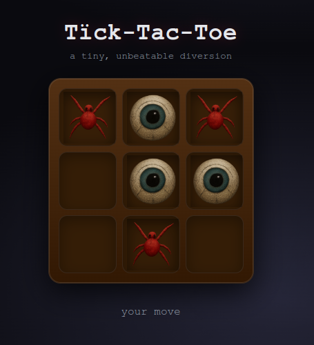

# Tic‑Tac‑Toe

A monorepo that contains a Tic-Tac-Toe game.



### Architecture

| Feature          | Description |
|------------------|------------------|
| Frontend         | React SPA (Vite) |
| Backend          | Python Flask API, and game logic |
| State            | Server-authoritative. Web client sends moves, server returns updated board |
| Containerization  | Separate Dockerfiles (client/server) |
| Deployment       | ECS Fargate (Not implemented) |

### API Design

Minimal, stateless API using a compact board representation to avoid server
session complexity. The board is a 9-char string, representing positions 0–8:

- empty: "."
- human: "X"
- AI: "O"

So for example, and empty board would be "........."

#### Endpoints

- `GET /health` -> `{ "ok": true }`
- `POST /api/new` -> `{ "board": ".........", next: "X" }`
- `POST /api/move` -> `{
    "aiMove": {
        "index": 4,
        "player": "O"
    },
    "board": "X...O....",
    "lastMove": {
        "index": 0,
        "player": "X"
    },
    "lines": null,
    "status": "playing"
}`

### Minimax

Uses [Minimax](https://en.wikipedia.org/wiki/Minimax#Combinatorial_game_theory)
algorithm (recursive search and scoring) for AI game play. The minimax logic is
implemented in the `tictactoe.py` module and examines every possible move to
determine the next best move. Each position on the board is scored according to a
win/loss/draw (+1/-1/0) for the AI, and the position with the maximum score for
the AI is returned.

## Running the Game

To run the game quickly in with a dev config, you can use the provided Makefile:

Install step:

```bash
make install
```

Run the api server and web client in separate shells:

```bash
make api
make web
```

## Development

### Server

Set up a virtual environment and install requirements:

```bash
cd server
python3 -m venv .venv
source .venv/bin/activate
pip install -r requirements.txt pytest
```

Run the server:

```bash
python3 app.py
```

#### Health check

```bash
curl http://localhost:8000/health
```

#### Running tests

```bash
cd server
pytest ./tests
```

#### Docker

Building a dev Docker image and running the server app:

```bash
sudo docker build --no-cache -t tictactoe-api:dev .
sudo docker run --rm -p 8000:8000 tictactoe-api:dev
```

### Web Client

Install requirements:

```bash
cd client
npm install -D vitest @vitejs/plugin-react @testing-library/react @testing-library/jest-dom
```

Run the web client:

```bash
npm run dev
```

#### Docker

Building a dev Docker image and running the client app:

```bash
sudo docker build --no-cache -t tictactoe-web:dev .
sudo docker run --rm -p 5173:5173 -e API_URL=http://localhost:8000 tictactoe-web:dev
```

## TODOs

The following is a partial to-do list to expand the game:

- Complete Fargate deployment
- Sound effects (on click, on win, on draw)
- Animated icons
- Improved background image
- Implement last-move prediction
- Auto-play (AI vs. AI)
- Multiplayer over network
- Leaderboard / score keeping
- Alternative board sizes (4x4, 5x5, 6x6, etc)
